# Discovering Bosnia: A brief history
### A trip to Bosnia.
I was invited by a friend to visit Bosnia. From Dublin to Bosnia, it’s a multi-city stop as there are currently no direct flights. I flew from Dublin to London Stansted, then Stansted to Sarajevo. The airport was incredibly small and dull. I had to take a bus from the airport along the main street by the river; however, I had leapt off the bus too early and noticed my data plan did not work outside of the EU, wandering around in hopes of finding a local shopping centre with free WiFi to get in touch with my friend. After a brief bit of confusion, we managed to find each other and check out my apartment from Airbnb.

# Miljacka
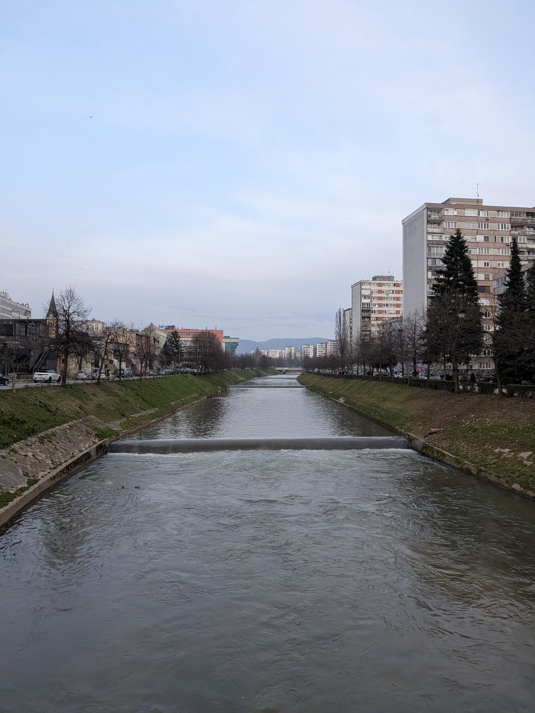

My first day consisted of walking down the Miljacka River, flowing centrally through the narrow capital. The architecture was quite brutalist and socialist; the city’s architecture was uninviting and seemed to just be sprawling flats with minor urban suburban areas.

# WW2

World War II artillery left on show but decaying in the elements behind the historical museum. It leaves a grim reminder of how close past tragedies are.

# Avaz twist tower
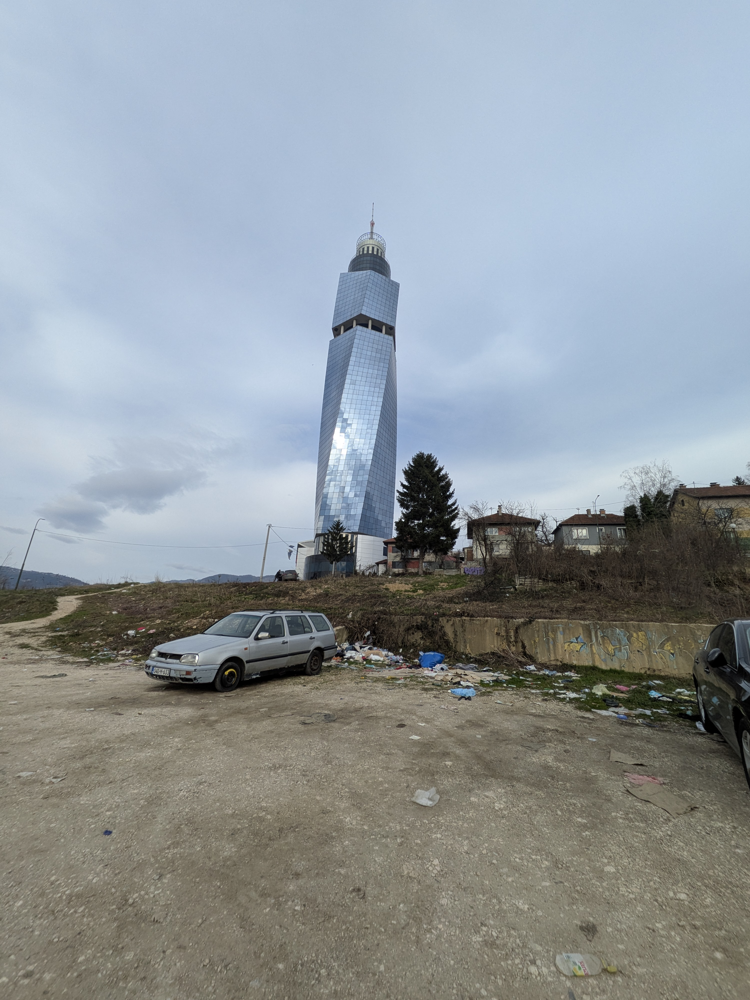

Unfortunately, every capital has unsightly areas; however, to be so close to a main attraction is abhorrent. As we walked to the main entrance, the area surrounding it was littered everywhere, the area itself also being a bit rundown.

# Mostar
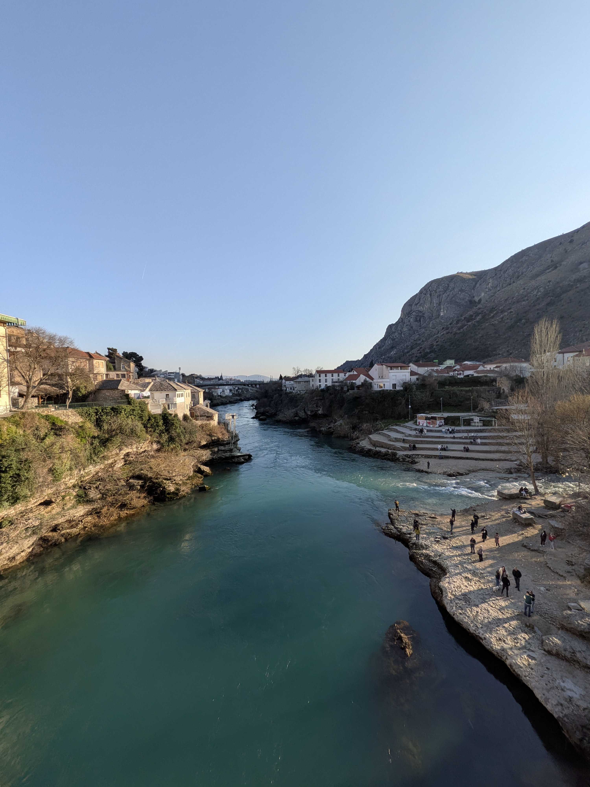

Mostar is a beautiful city with a history steeped in segregation. Like the capital of Bosnia, it’s an area where churches are not left open, and the city is divided based on religion to this current day.

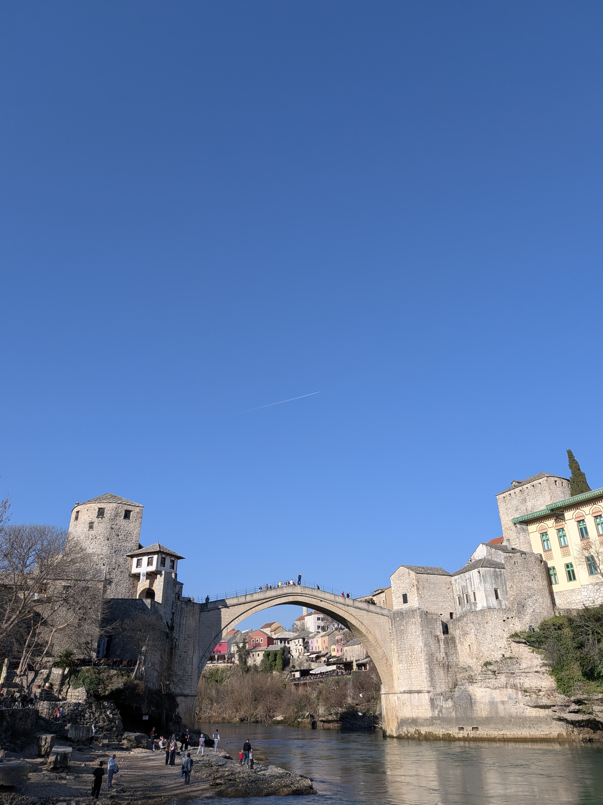

Stari Most, the Old Bridge, is a notable example of Balkan Islamic architecture. Originally built in 1566 during Ottoman rule in Bosnia and Herzegovina, it stood as a key connection across the Neretva River.

During the Croat–Bosniak War, the bridge became a strategic supply route for the Army of the Republic of Bosnia and Herzegovina (ARBiH). It was ultimately destroyed by artillery fire from the Croatian Defence Council (HVO) on 9 November 1993, leaving the crossing in ruins.

The bridge was later carefully reconstructed using materials and techniques matching the original stonework and was completed in 2004.

  
  

Modern memorials left behind from the Bosnia war; instead of forgetting the history, it has been incorporated into everyday life in simple ways, such as filling areas with mosaics.

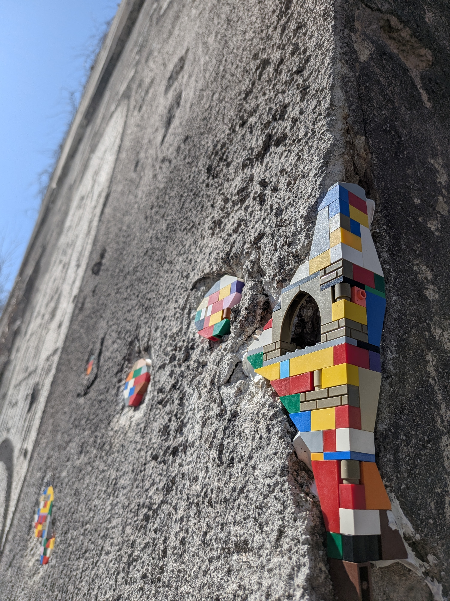

Other areas damaged by bullets or fragments.

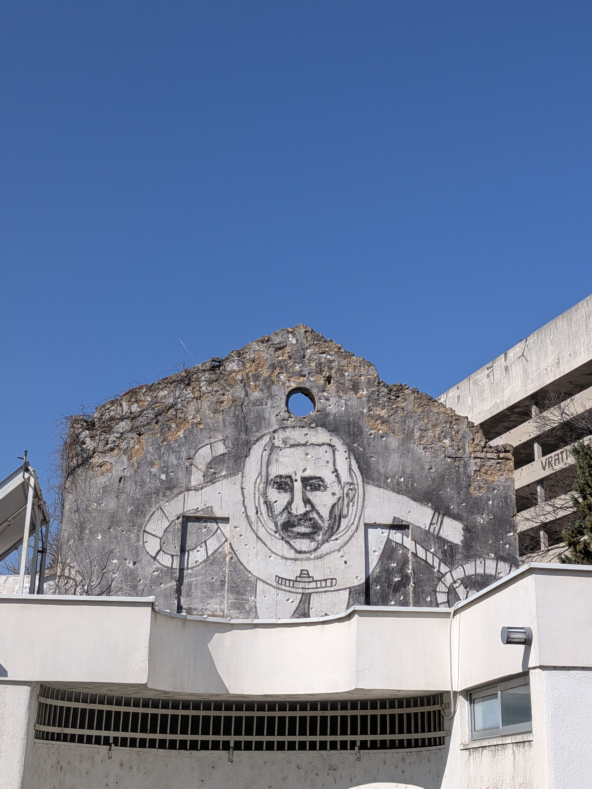

The building on the right was used as a sniper tower.

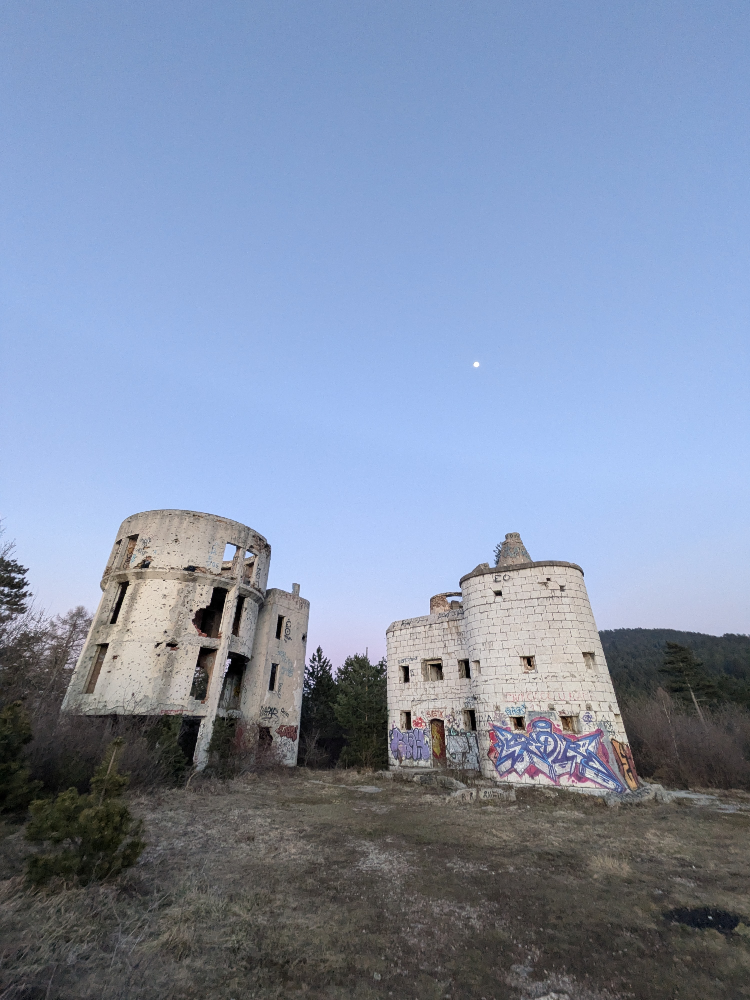

Back in Sarajevo, you can get a cable car to the top of a hill overlooking the city where the Winter Olympics were held 20 odd years ago. The area is now popular with local graffiti artists, hikers, and general tourists. The cable car was worth it as you gained a gradual view of the city’s skyline.

The old bobsleigh track is now littered with unique pieces of graffiti. It’s quite funny — the snow had melted in the surrounding area, but the shade and insulation on the bobsleigh track has allowed a lot of the snow and ice to remain long past the melt point in the area.

Wolf & prey

An interesting viewpoint on the way down is an abandoned observatory. The stairway is still intact and allows you to venture to the very top of the building on the left, though dangerous as there are many gaps and holes you can fall through.

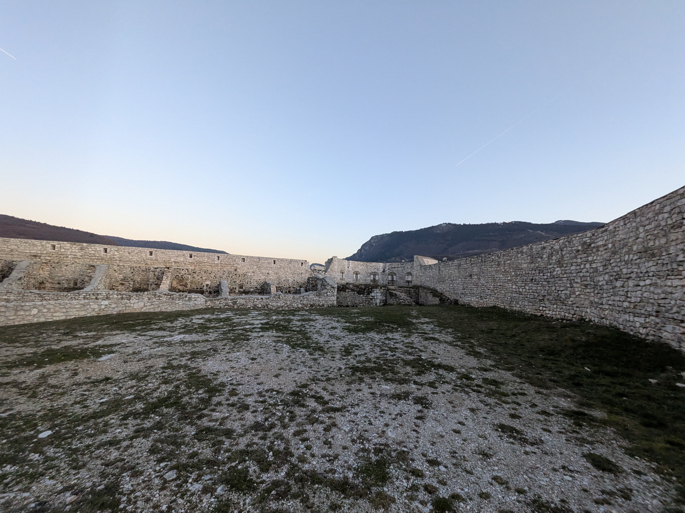

White Fortress, though now closed to the public under the guise of graffiti and dereliction. You can get a viewpoint by walking along the outer perimeter of the fence if you are tall enough.

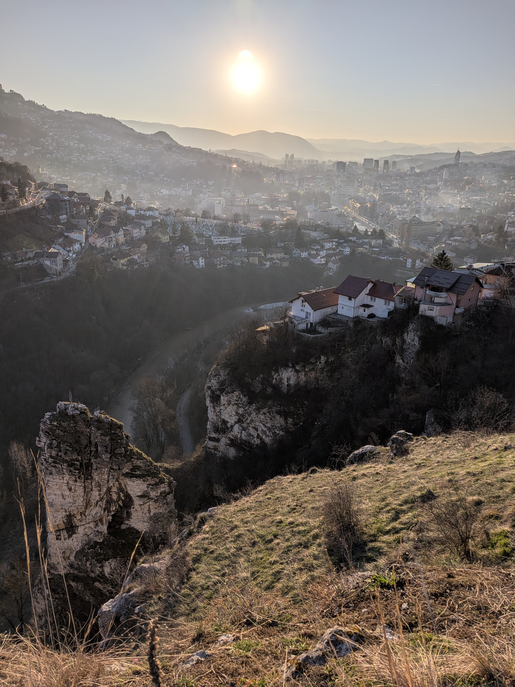

Viewpoint outside White Fortress overlooking Sarajevo. It’s hard to imagine this area not being used by snipers during the war.

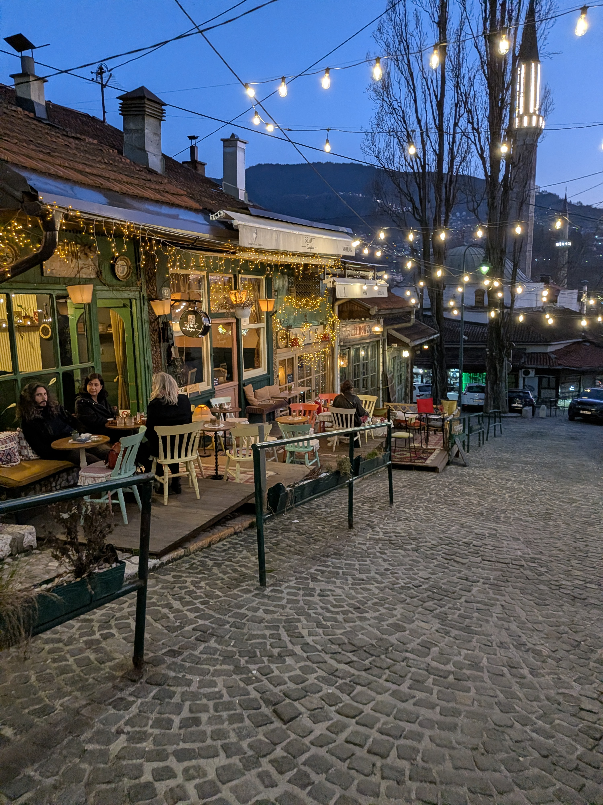

Baščaršija, an area of tourism comprised of Ottoman-era buildings. It is the main town square, though its simple architecture gives it a quaint yet minimal look in these one story buildings. Steps down from this area, you will meet more modern Austro-Hungarian architecture, which gives a more modern European vibe.

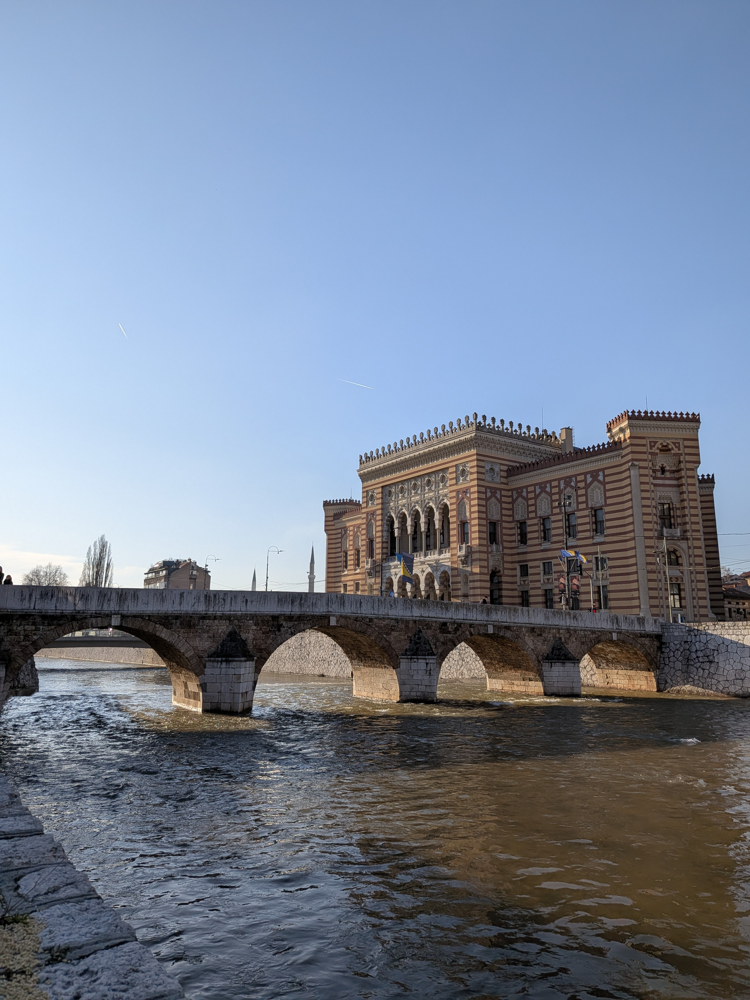

The city hall, hilariously, the area where the city hall was built was previously occupied by a house. As part of the arrangement for the city council to occupy the space, they were required to move the building brick by brick to the opposite side of the river. It now serves as a restaurant called the House of Spite, serving traditional meals. But on a real note, the traditional food is incredibly bland; somehow it is less flavourful than anything in Ireland.

